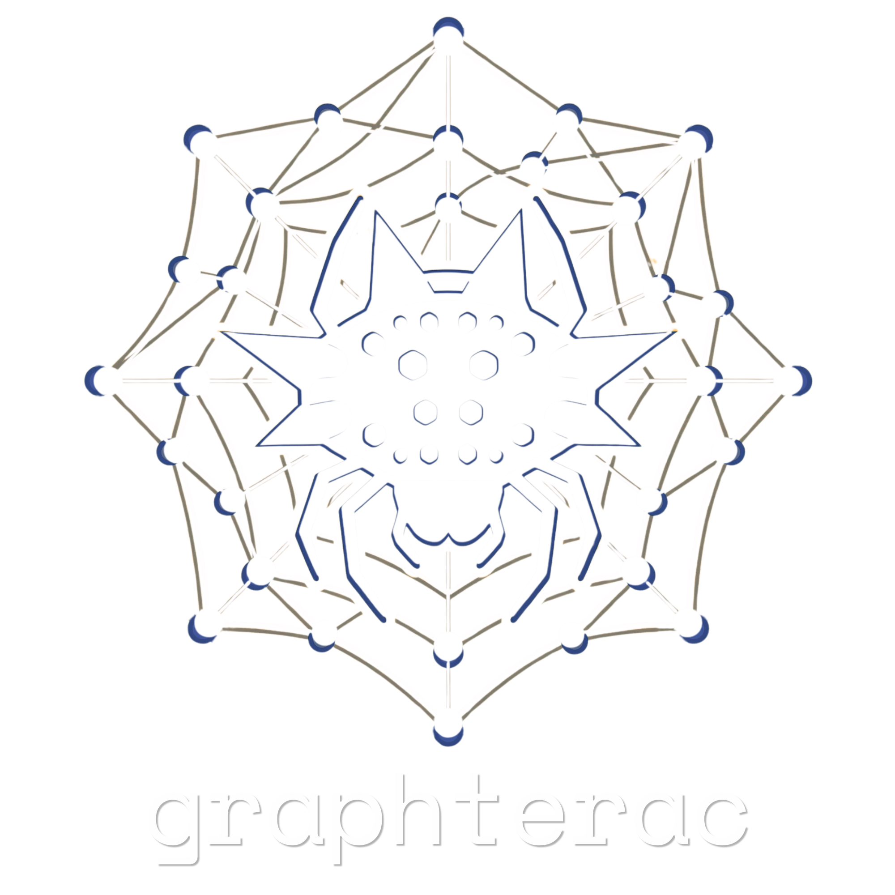
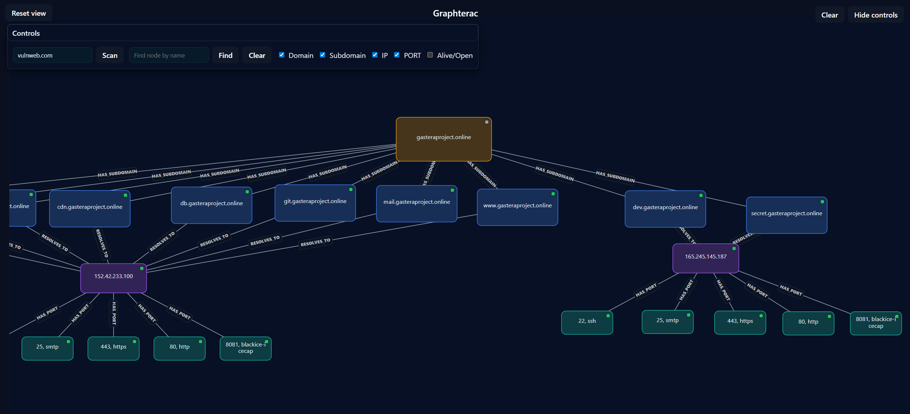
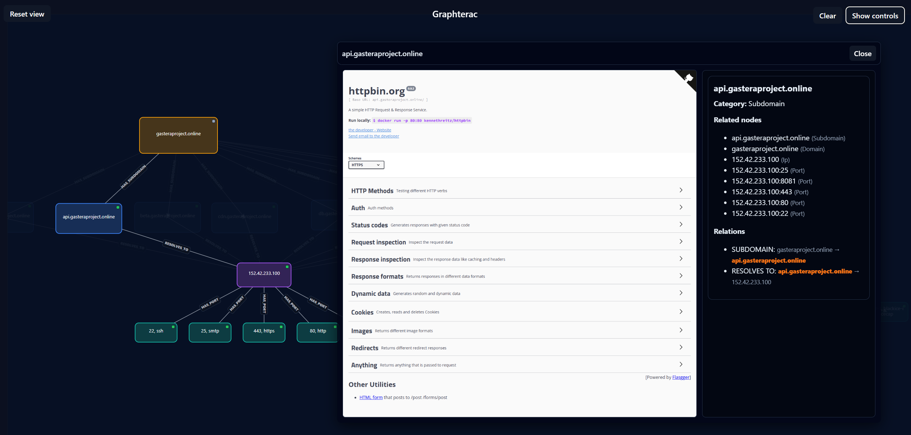
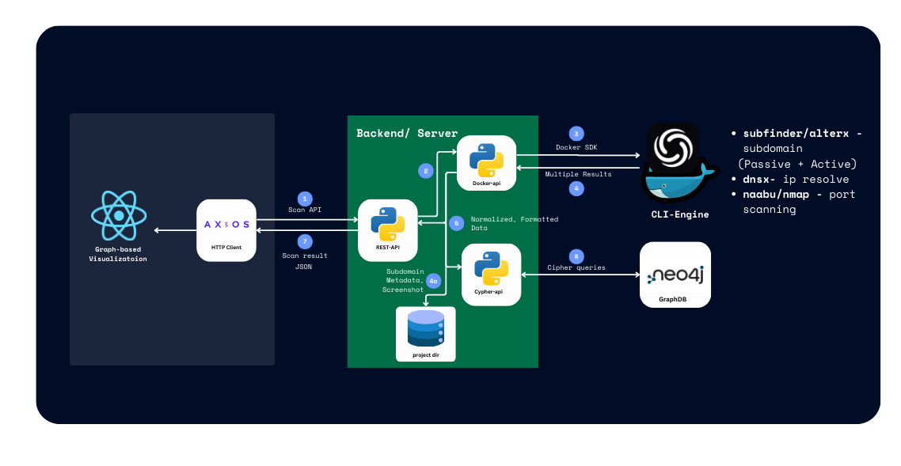

<h1 align="center">
	
    <br/>
</h1>

<h4 align="center">“Discovery. Automation. Visualization”</h4>

<div align="center">
    <a href="#preview">Preview</a> •
    <a href="#features">Features</a> •
    <a href="#project-structure">Project Structure</a> •
    <a href="#setup">Setup</a> •
</div>


**Graphterac** is an automated, graph-based asset intelligence platform designed to map an organization's external digital attack surface by visualizing the relationships between infrastructure components. The system moves beyond traditional linear reconnaissance by transforming fragmented data from various discovery tools into a unified graph.

## Preview





## Features
- Automates asset discovery (Subdomain, Screenshot, IP, Port)
- Relational Asset Intelligence
- Visualizes infrastructure as an interactive graph powered by [React Flow](https://reactflow.dev/)
  - Hierarchical tree layout (Domain → Subdomain → IP → Port)
  - Built-in pan, zoom, and fit-view controls
  - Minimap for birds-eye navigation
  - Connected-component highlighting on node selection
  - Search with visual highlighting and category-colored nodes

## Project structure
<h1 align="center">
    
</h1>

- `frontend/` — React + Vite UI (React Flow for graph visualization)
- `backend/` — Python API (FastAPI / uvicorn style) with Docker SDK
- Docker - Container CLI engine

## Setup
1. Clone the Repository

``` bash
git clone https://github.com/PlugsPakuko/Graphterac.git
cd Graphterac
```

2. Backend Configuration
The backend consists of a CLI-Engine (Docker container) and a FastAPI server.

``` bash
docker build -t graphterac ./backend
docker run -d  --name CLI-Engine graphterac
```

``` bash
pip install -r backend/requirements.txt
python run_uvicorn.py
```

3. Frontend Configuration
```bash
    cd frontend
    npm i
    npm run dev
```

## TO DO
- Implement more custom cli options for variability of techniques
- CRUD with separate project workspace at frontend
- Neo4j cipher integration for more filtering options

## References

- ProjectDiscovery — https://github.com/projectdiscovery (useful tools for discovery and automation such as subfinder, assetfinder, httpx, naabu, nuclei, and others). This project uses several discovery concepts and tooling workflows inspired by ProjectDiscovery's tools and research.
